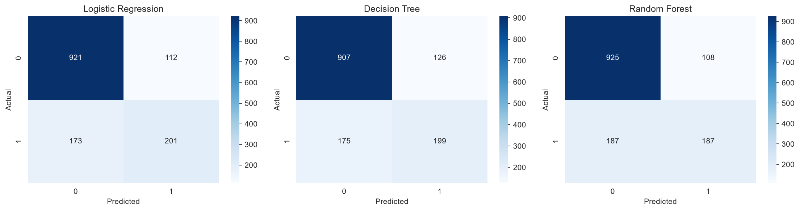
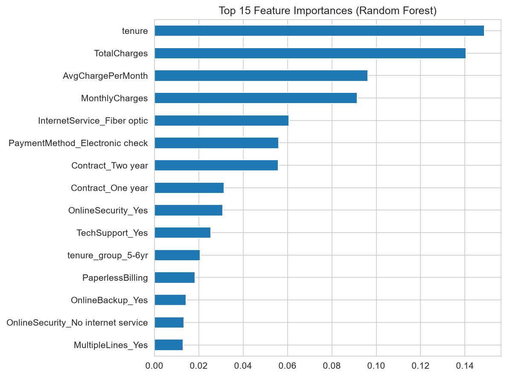

# Customer Churn Predictor

Predicts telecom customer churn using Logistic Regression, Decision Tree, and Random Forest models, with full EDA, feature engineering, and model comparison.

## Problem

Customer churn — when a customer stops using a company's service — is one of the most expensive problems for subscription-based businesses like telecoms. Identifying customers likely to churn *before* they leave lets a business target them with retention offers, which is far cheaper than acquiring new customers.

## Dataset

- **Source:** [Telco Customer Churn dataset](https://www.kaggle.com/datasets/blastchar/telco-customer-churn) (Kaggle)
- **Size:** 7,043 customers, 21 features
- **Target:** `Churn` (Yes/No)
- **Features:** demographic info (gender, senior citizen, partner, dependents), account info (tenure, contract type, payment method, charges), and service usage (phone, internet, streaming, tech support, etc.)

## Approach

1. **Data cleaning** — converted `TotalCharges` to numeric, dropped rows with missing values, removed the non-predictive `customerID` column.
2. **EDA** — analyzed churn distribution, numerical features (tenure, monthly/total charges) vs churn, categorical features (contract type, internet service, payment method) vs churn, and correlation among numeric features.
3. **Feature engineering** — created an `AvgChargePerMonth` feature, bucketed `tenure` into groups, encoded binary and categorical columns (one-hot encoding).
4. **Modeling** — trained and compared three models: Logistic Regression, Decision Tree, and Random Forest, using an 80/20 stratified train-test split with feature scaling.
5. **Evaluation** — compared models on Accuracy, Precision, Recall, F1, and ROC-AUC, and also tested a class-weight-balanced Random Forest to address class imbalance.

## Results

| Model | Accuracy | Precision | Recall | F1 | ROC-AUC |
|---|---|---|---|---|---|
| Logistic Regression | 0.7974 | 0.6422 | 0.5374 | 0.5852 | 0.8378 |
| Decision Tree | 0.7861 | 0.6123 | 0.5321 | 0.5694 | 0.8173 |
| Random Forest | 0.7903 | 0.6339 | 0.5000 | 0.5590 | 0.8338 |

**Logistic Regression** performed best overall, edging out Random Forest on F1 score and ROC-AUC, despite being the simplest model. All three models show similar recall, suggesting there's room to improve on catching more actual churners — a natural next step is testing SMOTE or class-weight balancing more thoroughly (already explored for Random Forest in the notebook).

### Confusion Matrices



### ROC Curves


### Feature Importance (Random Forest)



Key churn drivers: contract type (month-to-month customers churn far more than 1-2 year contract customers), tenure, and monthly charges.

## Tech Stack

Python · pandas · NumPy · scikit-learn · matplotlib · seaborn · Jupyter

## How to Run

```bash
git clone https://github.com/karan26612/customer-churn-predictor.git
cd customer-churn-predictor
pip install -r requirements.txt
```

Then either:
- Open `notebook.ipynb` in Jupyter to explore the full EDA and analysis, or
- Run the modeling pipeline directly from the command line:

```bash
python -m src.train
```

This trains all three models and saves the Random Forest model and scaler to `models/`.

## Project Structure

```
customer-churn-predictor/
├── data/
│   └── telco_churn.csv
├── src/
│   ├── preprocessing.py   # data loading, cleaning, feature engineering
│   ├── train.py           # model training
│   └── evaluate.py        # metrics comparison and plotting
├── images/                # saved plots used in this README
├── models/                # saved trained model + scaler
├── notebook.ipynb          # full EDA, analysis, and narrative
├── requirements.txt
└── README.md
```

## Next Steps

- Try gradient-boosted models (XGBoost, LightGBM) for potentially higher recall
- Hyperparameter tuning with GridSearchCV / RandomizedSearchCV
- Address class imbalance more systematically (SMOTE, threshold tuning)
- Deploy as an interactive Streamlit app for live predictions
